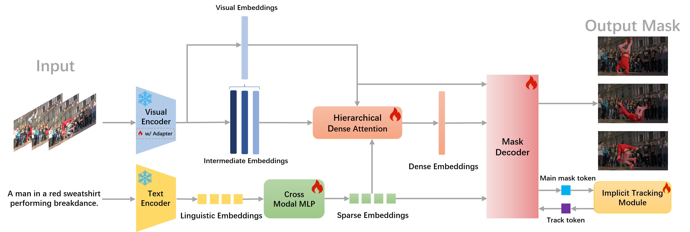
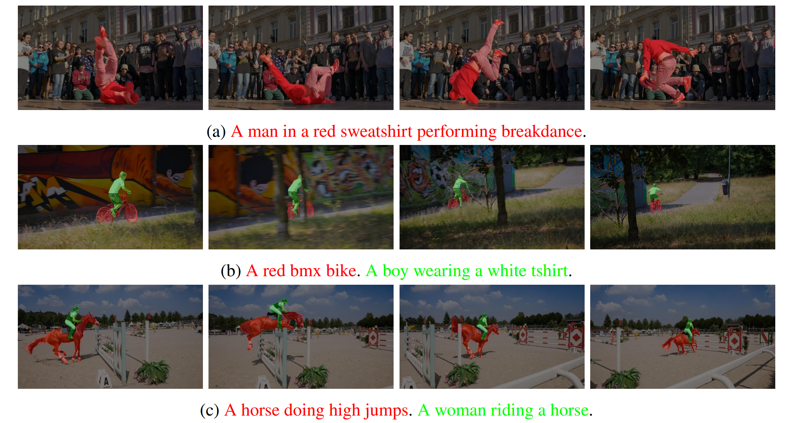
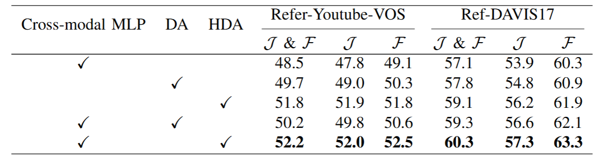
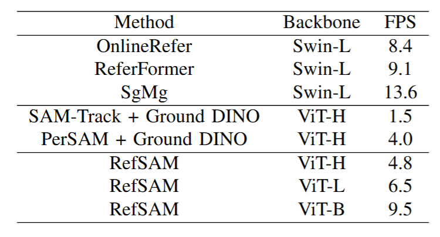

<h1 align="center"> RefSAM: Efficiently Adapting Segmenting Anything Model for Referring Video Object Segmentation </h1>
<p align="center">
<a href="https://arxiv.org/abs/2307.00997">"></a>
</p>
<h5 align="center"><em>Yonglin Li, Jing Zhang, Xiao Teng, Long Lan, Xinwang Liu</em></h5>
<p align="center">
  <a href="#introduction">Abstract</a> |
  <a href="#usage">Usage</a> |
  <a href="#results">Results</a> |
  <a href="#statement">Statement</a>
</p>

# Introduction

This is the official repository of the paper <a href=""> RefSAM: Efficiently Adapting Segmenting Anything Model for Referring Video Object Segmentation </a>

<figure>

<figcaption align = "center"><b>The overall pipeline of RefSAM. It mainly consists of five key components: 1) Backbone: Visual Encoder of SAM with Adapter and Text Encoder; 2) Cross-Modal MLP; 3) Hierarchical Dense Attention; 4) Mask Decoder of SAM; and 5) Implicit Tracking Module.
</b></figcaption>
</figure>

<p>

<p align="left"> In this study, we present the RefSAM model, which for the first time explores the potential of <a href="https://arxiv.org/abs/2304.02643"> SAM </a> for RVOS by incorporating multi-view information from diverse modalities and successive frames at different timestamps. Our proposed approach adapts the original SAM model to enhance cross-modality learning by employing a lightweight Cross-Modal MLP that projects the text embedding of the referring expression into sparse and dense embeddings, serving as user-interactive prompts. Subsequently, a parameter-efficient tuning strategy is employed to effectively align and fuse the language and vision features. Through comprehensive ablation studies, we demonstrate the practical and effective design choices of our strategy. Extensive experiments conducted on Ref-Youtu-VOS and Ref-DAVIS17 datasets validate the superiority and effectiveness of our RefSAM model over existing methods.

# Usage

# Results
## Results on RVOS datasets

<figure style="text-align: center;">

<figcaption align = "center"><b>Figure 2: Results on Ref-DAVIS17. 
 </b></figcaption>
</figure>

<p>

<figure style="text-align: center;">

<figcaption align = "center"><b>Figure 3: Results on Ref-Youtube-VOS. 
 </b></figcaption>
</figure>

<p>

A comprehensive comparison between RefSAM and existing methods.


## Visualization Results
### Visualization results of our RefSAM model on Ref-DAVIS17.

<figure>

<figcaption align = "center"><b>Figure 4: Some examples of RefSAM segmentation results on Ref-DAVIS17. 
 </b></figcaption>
</figure>

<p>

We show the visualization results of our RefSAM model. It can be seen that RefSAM is capable of effectively segmenting and tracking the referred object even in challenging scenarios, such as variations in person poses, and occlusions between instances.


### Visualization of different models on Ref-DAVIS17.

<figure>

<figcaption align = "center"><b>Figure 5: Visualization of different models on Ref-DAVIS17. From left to right: RefSAM, ReferFormer, SAM-Track + Ground DINO, and PerSAM + Ground DINO.
 </b></figcaption>
</figure>

<p>

Furthermore, we present the results of differnt models. It is clear that our RefSAM demonstrates significantly enhanced cross-modal understanding capability.


## Model Analysis
### The influence of different learning rates for the learnable modules

<figure>

<figcaption align = "center"><b>Figure 6: The influence of different learning rates for the learnable modules of RefSAM.</a>  
 </b></figcaption>
</figure>

### Ablation study of different module designs.

<figure>

<figcaption align = "center"><b>Figure 7: Ablation study of different module designs.
</a>  
 </b></figcaption>
</figure>


### Ablation study of the key components


<figure style="text-align: center;">

<figcaption align = "center"><b>Figure 8: Ablation study of the key compoents of RefSAM</a>  
 </b></figcaption>
</figure>


### Influence of the model size of Visual Encoder

<figure style="text-align: center;">

<figcaption align = "center"><b>Figure 9: Influence of the model size of Visual Encoder. </a>  
 </b></figcaption>
</figure>


### Number of learnable parameters of different Models

<figure style="text-align: center;">

<figcaption align = "center"><b>Figure 10: Number of learnable parameters of different Models</a>  
 </b></figcaption>
</figure>


### Inference speed of different models.

<figure style="text-align: center;">

<figcaption align = "center"><b>Figure 11: Inference speed of different models.</a>  
 </b></figcaption>
</figure>


# Statement

This project is for research purpose only. For any other questions please contact [yonglin_edu@163.com](mailto:yonglin_edu@163.com).


## Citation

<!-- If you find RefSAM helpful, please consider giving this repo a star:star: and citing:

```
@inproceedings{,
  title={},
  author={},
  booktitle={arxiv},
  year={arXiv preprint arXiv:}
}
``` -->

<!-- ## Relevant Projects

[1] <strong></strong> | [Paper]() | [Github]()
<br><em>&ensp; &ensp; &ensp;<sup>&#8727;</sup>, <sup>&#8727;</sup>, ,  and </em>
